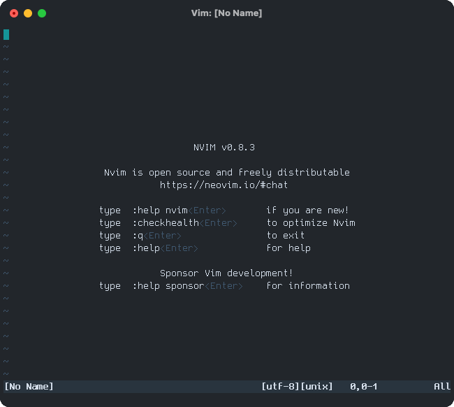
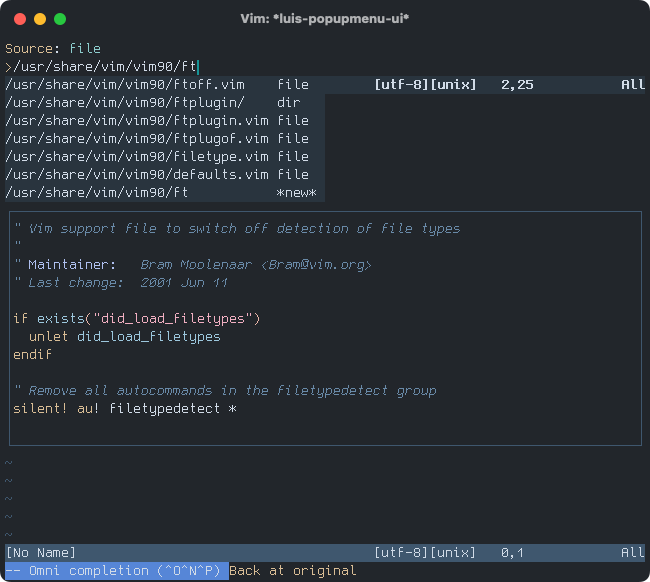

## Luis



**Luis**, which stands for **L**ookup **UI** for **S**ources, is a framework for providing a highly customizable fuzzy finder. Luis is designed with the following siz elements:

- **Source**, which gathers candidates. For example, the `buffer` source gathers the all existing buffers.
- **Kind**, which represents kind of candidate, and provides actions for a candidate. For example, the `buffer` kind provides actions for buffers, such as buffer deletion.
- **Matcher**, which filters candidates with a pattern, and sorts them based on their scores. For example, the `fuzzy` matcher performs fuzzy matching on candidates and sorts them based on their scores.
- **Comparer**, which defines the sorting order of candidates. For example, the `default` comparer sorts candidates in dictionary order based on the `'ignorecase'` option.
- **Previewer**, which provides a preview each candidates. For example, the `popup` previewer displays the information of candidates in a popup window.
- **UI**, which integrates these elements. For example, the `popupmenu` UI displays candidates using a completion menu.

## Features

- Pure Vimscript implementation, so it works with both Vim and NeoVim.
- All elements are modularized and only autoloaded when needed.
- You can easily create your own source with just a few lines of code, without
  creating a new file.
- Using an async source, you can ultra-fast matching for a huge amount of
  candidates.
- Using a hook, you can customize the behavior of existing sources.

## Usage

First, call `luis#new_session()` to create a session. Then, pass the created session to `luis#start()` to launch the UI. Now, let's create a simple wrapper function to perform these steps:

```vim
function! s:luis_start(source, options = {}) abort
  " Create a new session for the source.
  let session = luis#new_session(a:source, a:options)
  " Start the session and if it is successfull, store it.
  if luis#start(session)
    let s:luis_last_session = session
  endif
endfunction
```

Furthermore, it would be useful to define a function to resume the last started session.

```vim
function! s:luis_resume() abort
  " If the last started session exists, resume it.
  if exists('s:luis_last_session')
    call luis#start(s:luis_last_session)
  endif
endfunction
```

Next, define key mappings, such as the following:

```vim
nnoremap <Leader>l/  :<C-u>call <SID>luis_start(luis#source#history#new('search'))<CR>
nnoremap <Leader>l:  :<C-u>call <SID>luis_start(luis#source#history#new('cmd'))<CR>
nnoremap <Leader>lM  :<C-u>call <SID>luis_start(luis#source#mark#new())<CR>
nnoremap <Leader>lT  :<C-u>call <SID>luis_start(luis#source#tagstack#new(win_getid()))<CR>
nnoremap <Leader>l\  :<C-u>call <SID>luis_start(luis#source#history#new('expr'))<CR>
nnoremap <Leader>la  :<C-u>call <SID>luis_start(luis#source#args#new())<CR>
nnoremap <Leader>lb  :<C-u>call <SID>luis_start(luis#source#buffer#new())<CR>
nnoremap <Leader>lc  :<C-u>call <SID>luis_start(luis#source#colorscheme#new())<CR>
nnoremap <Leader>lf  :<C-u>call <SID>luis_start(luis#source#file#new())<CR>
nnoremap <Leader>lj  :<C-u>call <SID>luis_start(luis#source#jumplist#new(win_getid()))<CR>
nnoremap <Leader>ll  :<C-u>call <SID>luis_resume()<CR>
nnoremap <Leader>lm  :<C-u>call <SID>luis_start(luis#source#local_mark#new(bufnr('%')))<CR>
nnoremap <Leader>lo  :<C-u>call <SID>luis_start(luis#source#oldfiles#new())<CR>
nnoremap <Leader>lq  :<C-u>call <SID>luis_start(luis#source#quickfix#new())<CR>
nnoremap <Leader>lr  :<C-u>call <SID>luis_start(luis#source#register#new())<CR>
nnoremap <Leader>ls  :<C-u>call <SID>luis_start(luis#source#spell#new())<CR>
nnoremap <Leader>lt  :<C-u>call <SID>luis_start(luis#source#tags#new())<CR>
nnoremap <Leader>lz  :<C-u>call <SID>luis_start(luis#source#fold#new(win_getid()))<CR>
```

In this way, you have defined key mappings to start Luis with any sources. Finally, let's explain about how to use the default `popupmenu` UI.



- If you find what you want in the menu, choose it with <kbd>&lt;C-n&gt;</kbd> or <kbd>&lt;C-p&gt;</kbd>. If the first candidate in the menu is what you want, you don't have to choose it.
- Then you can take an action on the candidate with <kbd>&lt;Enter&gt;</kbd> or <kbd>&lt;Tab&gt;</kbd>.
  - With <kbd>&lt;Enter&gt;</kbd>, Luis executes the default action for the candidate.
  - With <kbd>&lt;Tab&gt;</kbd>, Luis shows a list of available actions for the candidate. Each action is labeled with a key to execute it. If you type one of the keys, the corresponding action will be executed.
- If you don't want to take any action and stop to select, typing <kbd>&lt;Esc&gt;</kbd> or <kbd>&lt;C-c&gt;</kbd> will close the window showing the menu and quit the session.
- If Auto Component Completion (ACC) is enabled for a source, whenever a special character is typed, the names of appropriate components will be automatically inserted. For example, in the `file` source, when the directory seperator character such as `/` is typed, the appropriate directory names will be automatically inserted.

## Using Async Source

Async sources gather candidates via an external process using the Vim or NeoVim Job API. In addition to collecting candidates, the external process handles filtering and sorting, ensuring that the UI is not blocked.

Async sources require the source command and the filter command. The source command responsible for generating the candidate output, such as `find` or `git`. The filter is the filter command used to filter and sort the candidates with a pattern from the output of the source command.

[`fzf-filter`](https://github.com/emonkak/fzf-filter) is a useful implementation of a filter command that performs the fuzzy matching on the output of a source command. To create an async source for the `git` command using `fzf-filter`, you can configure it as follows:

```vim
function! s:luis_start_async_git_files() abort
  let command = [
  \   'fzf-filter', '-f', '1', '-p', '2', '-d', ' ', '-l', '1000',
  \   '--',
  \   'git', 'ls-files', '--exclude-standard', '-v', '-c', '-o',
  \ ]
  let options = {
  \   'to_candidate': function('s:to_git_files_candidate'),
  \ }
  let source = luis#source#async#new(
  \   'git_files',
  \   luis#kind#file#import(),
  \   command,
  \   options
  \ )
  call s:luis_start(source)
endfunction

function! s:to_git_files_candidate(line) abort
  let components = split(a:line, '^\S\zs\s')
  let type = get(components, 0, '?')
  let path = get(components, 1, '')
  return {
  \   'word': path,
  \   'kind': type,
  \   'user_data': {
  \     'preview_path': path,
  \   },
  \ }
endfunction

nnoremap <Leader>lg  :<C-u>call <SID>luis_start_async_git_files<CR>
```

Similarly, to create an `async` source for the [`fd`](https://github.com/sharkdp/fd) command, you can configure it as follows:

```vim
function! s:luis_start_async_fd() abort
  let command = [
  \   'fzf-filter', '-l', '1000',
  \   '--',
  \   'fd', '--type', 'f', '--strip-cwd-prefix', '-c', 'never', '--max-results', '10000',
  \ ]
  let options = {
  \   'to_candidate': { line -> {
  \     'word': line,
  \     'user_data': { 'preview_path': line },
  \   }},
  \ }
  let source = luis#source#async#new(
  \   'fd',
  \   luis#kind#file#import(),
  \   command,
  \   options
  \ )
  call s:luis_start(source)
endfunction

nnoremap <Leader>ld  :<C-u>call <SID>luis_start_async_fd<CR>
```

## API

Please see the [documentation](https://github.com/emonkak/vim-luis/blob/master/doc/luis.txt).

## Acknowledgment

Luis is a fork of [ku](https://github.com/kana/vim-ku). I extend my thanks to [kana](https://github.com/kana).
